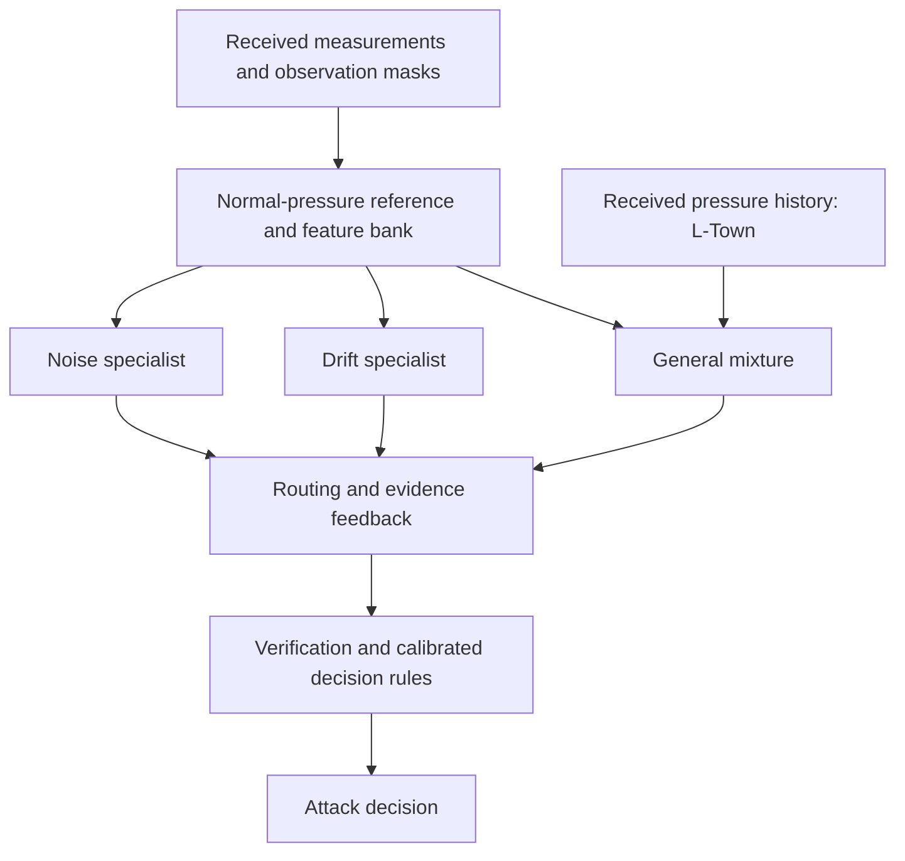

# Architecture and implementation map

The selected system detects random, replay, drift, noise and targeted sensor attacks using received measurements and a learned normal-pressure reference. Clean simulator values, attack parameters and event labels are not inference inputs. Labels and event identities are retained for supervised training and evaluation.

General has five internal tree-based components: general, abrupt, replay, drift and noise. These are distinct from the three top-level branches and from the six graph/recurrent experts used earlier in the project. L-Town General uses the original 42 additional history features (158 total). The specialist decisions allow three hours of evidence after the target timestamp; their scores must be interpreted with that delay.

| Component | Source |
|:---|:---|
| Blind and robust normal references | `src/wdn/models/blind_reference.py`, `src/wdn/models/robust_reference.py` |
| Residual General mixture | `src/wdn/probe_residual_experts.py` |
| Drift and seasonal specialists | `src/wdn/models/tuned_family_tree.py`, `src/wdn/models/seasonal_family.py` |
| Delayed evidence | `src/wdn/delayed_decision_features.py` |
| Routing and feedback | `src/wdn/evidence_feedback.py` |
| Early warning and verification | `src/wdn/early_warning.py`, `src/wdn/alarm_verifier.py` |
| Received-pressure history | `src/wdn/observed_history.py` |
| Final selection and reporting | `thesis_v2/experiments/early_warning/final_ten_model_seeds.py` |

The final Modena selection is the confirmed Stage-E candidate. The final L-Town selection is the confirmed full-history General extension with its protected specialist pipeline. Exact calibration and artifact identities are recorded in `results/final/`.
